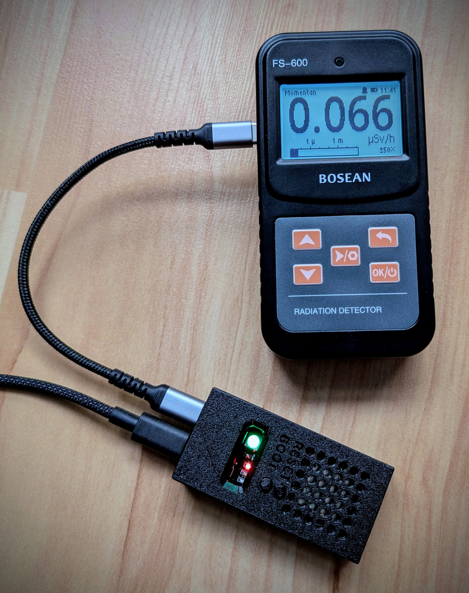
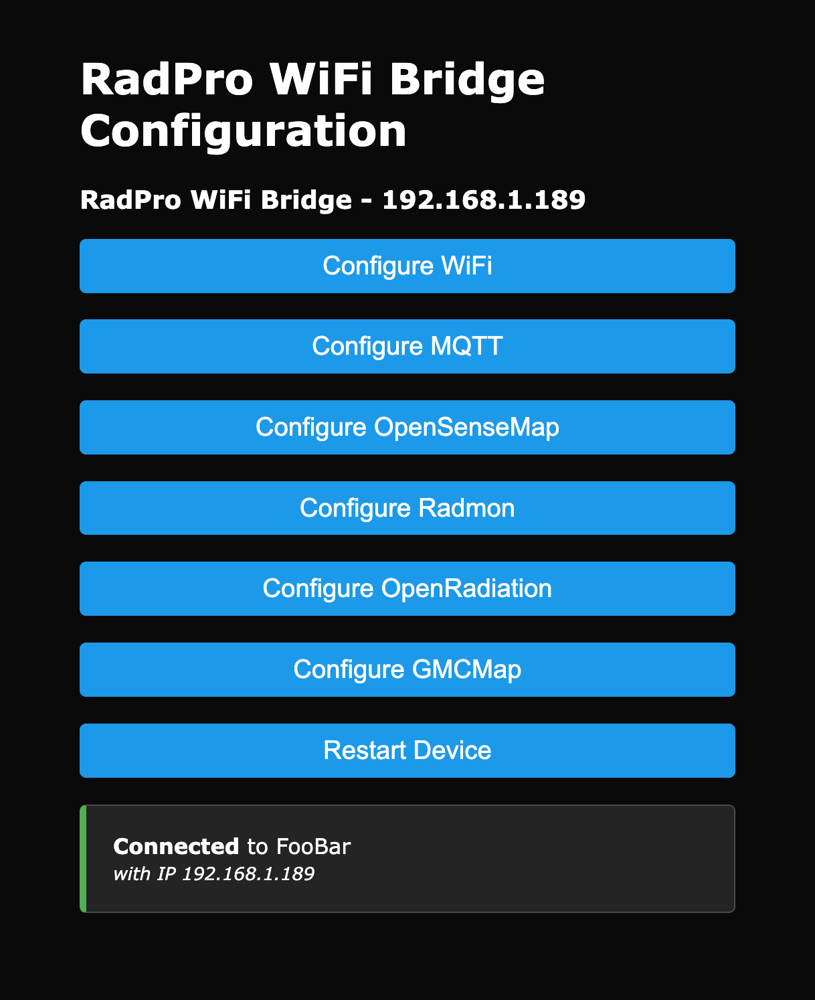
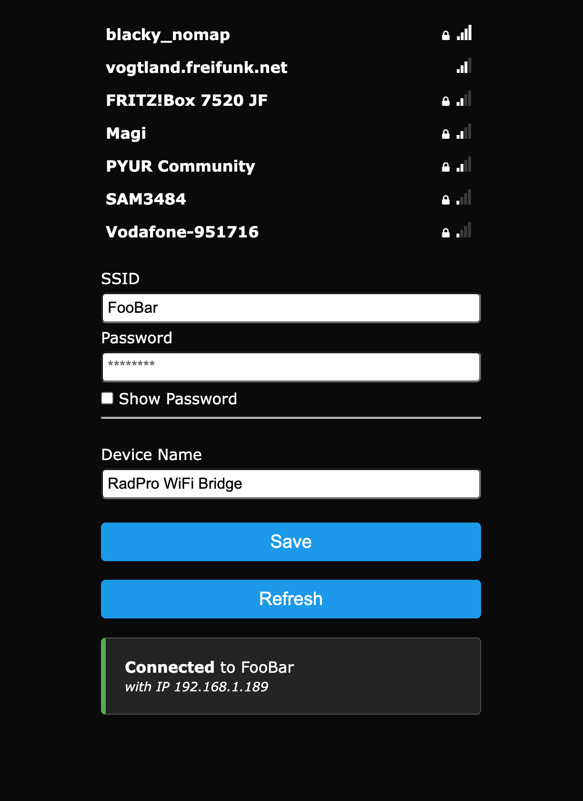

# RadPro WiFi Bridge (ESP32-S3)



Wi-Fi/USB bridge firmware for **Bosean RadPro (FS-600) class** Geiger counters.  
The ESP32-S3 enumerates the detector as a vendor-specific CDC device, provides status over the debug UART, keeps a heartbeat on the on-board WS2812, and mirrors telemetry to MQTT. Configuration is handled through a captive portal that stays available as a normal web UI once the device is on the network.

**Compatibility note:** So far this code has been tested only with the **Bosean FS‑600** running firmware **“Rad Pro 3.0.1”**. If you encounter problems with other adapters, please open an issue so we can track it. I’m happy to help, but I can’t afford to buy every device — get in touch if you’re able to loan or sponsor hardware for debugging.

---

## Highlights

- **TinyUSB host stack** with a CH34x VCP shim so the RadPro enumerates reliably on the ESP32-S3 OTG port.
- **DeviceManager command queue** that boots the tube, logs identity/metadata, and keeps issuing telemetry `GET` commands.
- **Wi-Fi configuration portal** (WiFiManager based) that launches an AP when credentials fail, serves the same form at `http://<device-ip>/`, and persists settings to NVS. A one-click “Restart Device” action is exposed in the UI.
- **Runtime Wi-Fi diagnostics & startup control**: countdown-driven boot with serial overrides, plus SSID/IP/RSSI logging after the main firmware starts.
- **MQTT publisher** with templated topics. Every successful RadPro response is forwarded at the configured `readIntervalMs`; publish success/failure drives LED pulses and console messages.
- **Cloud publishers** for MQTT, OpenSenseMap, GMCMap, and Radmon.org with per-service toggles in the web portal.
- **Home Assistant discovery** payloads so MQTT entities appear automatically once the bridge is online.
- **RGB LED state machine** (WS2812 on GPIO 48) that communicates boot, Wi-Fi, USB, and error states without needing the serial console.

---

## Hardware Assembly

Need help soldering the ESP32-S3 jumpers or printing the enclosure? Follow the step-by-step guide in [docs/assembly.md](docs/assembly.md).

---

## Web Installer (ESP Web Tools)

Flash the bridge firmware straight from your browser: https://SunboX.github.io/radpro-wifi-bridge/web-install/

Connect the ESP32-S3 via USB, click **Install**, and follow the prompts—no local toolchain required.

---

## PlatformIO Install

1. Install [PlatformIO](https://platformio.org/) and open this project.
2. The default environment targets **ESP32-S3 DevKitC-1 (N16R8)** with TinyUSB host support (`platformio.ini`) and a custom `partitions.csv` that provides a 6 MB application slot (make sure that file is present when building).
3. Connect the board with **two** USB cables:
   - CP210x (UART) port → logs & commands (`Serial0`, 115200 baud).
   - Native USB-OTG port → leave free for the RadPro sensor.
4. Flash with `platformio run --target upload` (or `--target upload --target monitor` to auto-open the serial monitor).

---

## First Boot & Portal

1. Watch the countdown on the UART. Enter `start` to skip the delay or adjust it with `delay <ms>`.
2. On first boot— or whenever stored credentials fail— the firmware hosts a captive portal named `<device name> Setup`. After Wi-Fi joins successfully the same configuration UI is served at `http://<device-ip>/`.

---

## Wi-Fi Configuration Portal

`WiFiPortalService` keeps the setup UI reachable whether the bridge is broadcasting a captive portal (`<deviceName> Setup`) or already joined to your LAN (`http://<device-ip>/`). Use it to edit Wi-Fi credentials, toggle MQTT/OpenSenseMap/GMCMap/Radmon publishers, or trigger a remote restart (`/restart`). All changes are persisted to NVS immediately and the console logs SSID/IP/RSSI updates for quick troubleshooting.





---

## MQTT Publishing

Need a step-by-step walkthrough? See [docs/mqtt-home-assistant.md](docs/mqtt-home-assistant.md) for detailed MQTT broker setup and Home Assistant discovery notes.

The `MqttPublisher` mirrors every RadPro response to MQTT once you enable it in the portal. Topics are templated (`stat/radpro/<deviceid>/<leaf>` by default), retained, and paired with Home Assistant discovery payloads so entities appear automatically. Successful publishes pulse the LED green; failures pulse red and are logged to the console.

---

## OpenSenseMap Publishing

For screenshots and a full walkthrough see [docs/opensensemap.md](docs/opensensemap.md).

Toggle the feature on via **Configure OpenSenseMap**, paste in your box/token/sensor IDs, and the bridge will bundle tube rate + dose rate readings into HTTPS posts every few seconds. Nothing is transmitted while the toggle is off or IDs are blank.

---

## GMCMap Publishing

Need screenshots and credentials pointers? See [docs/gmcmap.md](docs/gmcmap.md).

Enable GMCMap support, enter your Account ID/Device ID, and the bridge posts CPM + µSv/h pairs to `log2.asp` roughly once per minute. Leave it disabled if you don’t use GMCMap—no traffic is generated unless credentials are populated.

---

## Radmon Publishing

For screenshots and the full walk-through see [docs/radmon.md](docs/radmon.md).

Enable the Radmon toggle, enter your station username plus data-sending password, and the bridge submits CPM (and µSv/h when available) once per minute. Disable the feature if you don’t use radmon.org; no HTTP requests are made until valid credentials exist.

---

## LED Feedback

Base modes communicate long-running state (default brightness is gentle to avoid glare):

| Mode             | Pattern / Colour                                  | Meaning |
|------------------|---------------------------------------------------|---------|
| `Booting`        | Magenta blink (~0.4 s period)                     | Firmware initialising before the countdown runs. |
| `WaitingForStart`| Yellow blink (~0.6 s period)                      | Startup delay active; awaiting timeout or `start` command. |
| `WifiConnecting` | Blue blink (~0.6 s period)                        | Attempting to join the configured WLAN. |
| `WifiConnected`  | Cyan steady                                       | Wi-Fi joined; USB device not yet ready. |
| `DeviceReady`    | Bright green steady                               | RadPro enumerated and telemetry queue active. |
| `Error`          | Amber blink (~0.5 s period)                       | Last device command or MQTT publish failed— check the console. |

Event pulses temporarily override the base colour:

- **MQTT success:** bright green flash (~150 ms).
- **MQTT failure / command error:** bright red flash (~250 ms) and a console log (`MQTT publish failed.` or `Device command failed: <id>`).

### Fault Blink Codes

Certain faults latch a repeating red/orange sequence so you can diagnose issues without watching the serial log. The pattern always starts with **one red blink**, followed by the number of **orange blinks** listed below; the sequence then pauses briefly and repeats.

| Code | Issue | LED pattern |
|------|-------|-------------|
| 1 | NVS load failed (preferences missing) | red ×1 → orange ×1 |
| 2 | NVS write failed (configuration not saved) | red ×1 → orange ×2 |
| 3 | Wi‑Fi authentication / association error | red ×1 → orange ×3 |
| 4 | Wi‑Fi connected but no IP (DHCP/gateway) | red ×1 → orange ×4 |
| 5 | Captive/config portal still required | red ×1 → orange ×5 |
| 6 | MQTT broker unreachable / DNS failure | red ×1 → orange ×6 |
| 7 | MQTT authentication failure | red ×1 → orange ×7 |
| 8 | MQTT connection reset while publishing | red ×1 → orange ×8 |
| 9 | MQTT discovery payload exceeded buffer | red ×1 → orange ×9 |
| 10 | USB device disconnected / CDC error | red ×1 → orange ×10 |
| 11 | USB interface descriptor parse failure | red ×1 → orange ×11 |
| 12 | TinyUSB handshake unsupported | red ×1 → orange ×12 |
| 13 | `GET deviceId` timed out | red ×1 → orange ×13 |
| 14 | Command queue timeout / retries exhausted | red ×1 → orange ×14 |
| 15 | Tube sensitivity missing (dose rate unavailable) | red ×1 → orange ×15 |
| 16 | Wi‑Fi reconnect after config save still failing | red ×1 → orange ×16 |
| 17 | Captive portal resource exhaustion | red ×1 → orange ×17 |
| 18 | LED controller stuck in Wi‑Fi mode | red ×1 → orange ×18 |
| 19 | Application image larger than partition | red ×1 → orange ×19 |
| 20 | Upload attempted on wrong serial port | red ×1 → orange ×20 |
| 21 | Home Assistant using stale discovery state | red ×1 → orange ×21 |
| 22 | Home Assistant broker without retained discovery | red ×1 → orange ×22 |
| 23 | Last reset caused by brownout | red ×1 → orange ×23 |
| 24 | Last reset caused by watchdog | red ×1 → orange ×24 |

The lowest-numbered active fault is displayed. Resolving the root cause (for example, restoring Wi‑Fi credentials or saving NVS successfully) clears that code and reveals any higher-numbered faults that remain. Some codes are reserved for diagnostic scenarios outside normal runtime, but the blink language stays consistent if you raise them manually.

---

## Serial Console Commands (`Serial0`)

| Command      | Description                                                   |
|--------------|---------------------------------------------------------------|
| `start`      | Skip the remaining startup delay and begin immediately.       |
| `delay <ms>` | Set a new startup delay (milliseconds) and restart the timer. |
| `raw on/off` | Enable or disable raw USB frame logging.                      |
| `raw toggle` | Toggle raw USB logging.                                       |

While waiting for the boot delay the console prints `Starting in …` once per second. After the bridge starts, only device data, Wi-Fi status changes, and MQTT diagnostics are logged— the old “Main loop is running.” chatter is gone.

Raw USB logging is invaluable when reverse-engineering RadPro responses; disable it once finished to minimise serial traffic.

---

## Device Telemetry Flow

1. **USB enumeration** uses TinyUSB with a CH34x fallback so the RadPro reliably appears as a CDC device.
2. **Handshake:** `GET deviceId` logs the raw ID, model, firmware, and locale. Additional metadata (`devicePower`, `deviceBatteryVoltage`, `deviceTime`, `tube` parameters) is fetched immediately afterwards.
3. **Continuous polling:** `GET tubePulseCount` and `GET tubeRate` are queued at the configured interval (`readIntervalMs`, clamped to ≥ 500 ms).
4. **MQTT forwarding:** each successful response is offered to the MQTT publisher; failures propagate to the LED and console.
5. **Optional diagnostics:** enable raw USB logging for byte-level traces or request `randomData` / `dataLog` from higher-level code to stream ad-hoc payloads.

Retries, back-off, and duplicate suppression are handled inside `DeviceManager`.

---

## Project Structure

| Path                                   | Purpose |
|----------------------------------------|---------|
| `src/main.cpp`                         | Arduino entry point: startup state machine, Wi-Fi orchestration, LED updates, telemetry loop. |
| `lib/UsbCdcHost`                       | TinyUSB host wrapper plus CH34x helper for the vendor CDC transport. |
| `lib/DeviceManager`                    | RadPro command queue, response parsing, publish callbacks, retry/back-off logic. |
| `lib/AppSupport/AppConfig`             | NVS-backed configuration storage and parameter helpers. |
| `lib/AppSupport/ConfigPortal`          | WiFiManager integration, captive/station portal, restart endpoint, Wi-Fi logging. |
| `lib/AppSupport/Mqtt`                  | PubSubClient-based MQTT publisher with topic templating and slug generation. |
| `lib/AppSupport/Led`                   | WS2812 status controller and LED pulse handling. |
| `platformio.ini`                       | PlatformIO configuration for ESP32-S3 DevKitC-1 with TinyUSB host. |

---

## Roadmap

- Push CPM / pulse counts to cloud services such as **OpenSenseMap**, **GMCMap**, and **Radmon.org**.
- Add configurable reporting thresholds / batching beyond the global interval.
- Integrate OTA firmware updates.

---

## License

This project is licensed under the **MIT License**.

```
MIT License

Copyright (c) 2025 RadPro WiFi Bridge contributors

Permission is hereby granted, free of charge, to any person obtaining a copy
of this software and associated documentation files (the "Software"), to deal
in the Software without restriction, including without limitation the rights
to use, copy, modify, merge, publish, distribute, sublicense, and/or sell
copies of the Software, and to permit persons to whom the Software is
furnished to do so, subject to the following conditions:

The above copyright notice and this permission notice shall be included in all
copies or substantial portions of the Software.

THE SOFTWARE IS PROVIDED "AS IS", WITHOUT WARRANTY OF ANY KIND, EXPRESS OR
IMPLIED, INCLUDING BUT NOT LIMITED TO THE WARRANTIES OF MERCHANTABILITY,
FITNESS FOR A PARTICULAR PURPOSE AND NONINFRINGEMENT. IN NO EVENT SHALL THE
AUTHORS OR COPYRIGHT HOLDERS BE LIABLE FOR ANY CLAIM, DAMAGES OR OTHER
LIABILITY, WHETHER IN AN ACTION OF CONTRACT, TORT OR OTHERWISE, ARISING FROM,
OUT OF OR IN CONNECTION WITH THE SOFTWARE OR THE USE OR OTHER DEALINGS IN THE
SOFTWARE.
```
