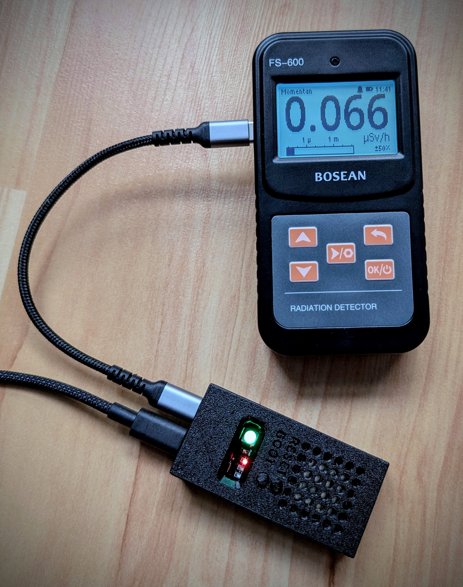
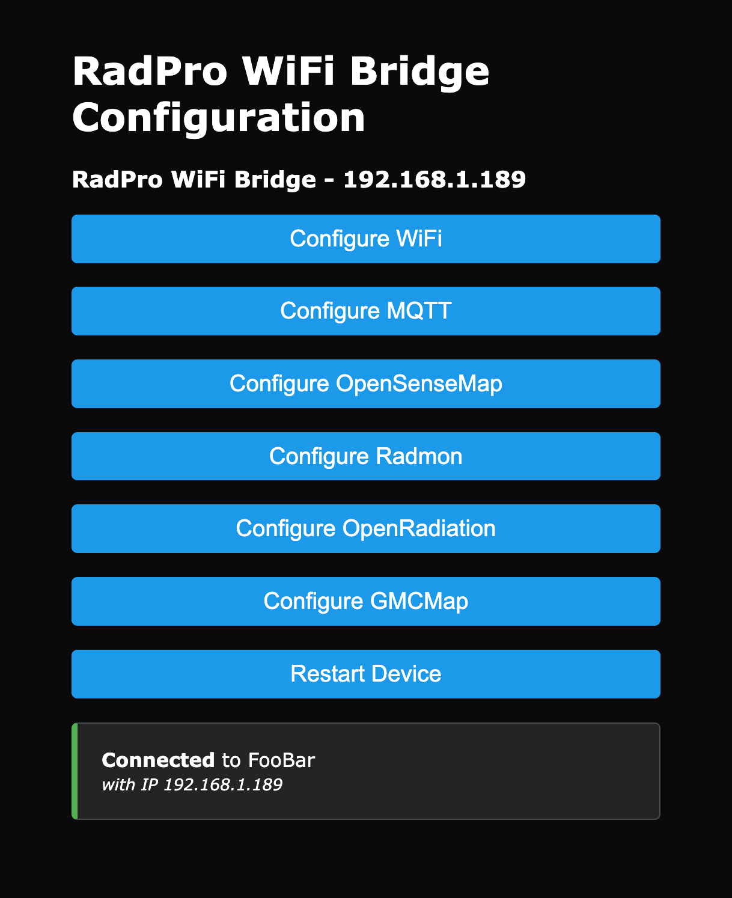
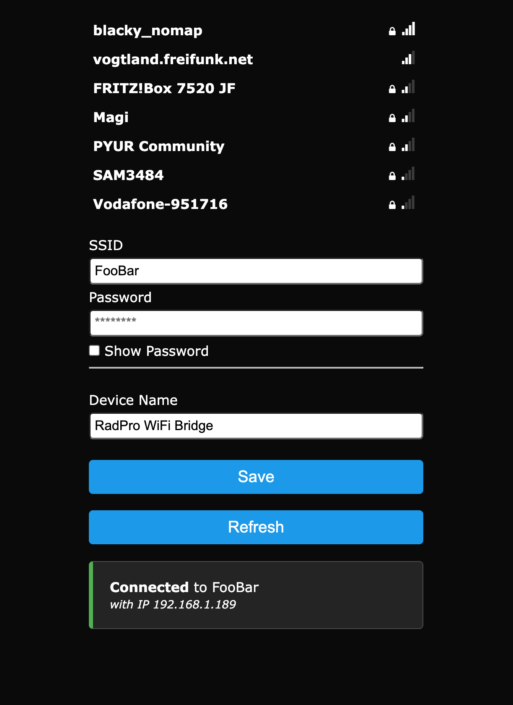

# RadPro WiFi Bridge (ESP32-S3)

Wi-Fi/USB bridge firmware for **Rad Pro class** Geiger counters, built on the excellent open-source Rad Pro firmware from https://github.com/Gissio/radpro.  
The ESP32-S3 enumerates the detector as a vendor-specific CDC device, provides status over the debug UART, keeps a heartbeat on the on-board WS2812, and mirrors telemetry to MQTT plus supported open-data services. Configuration is handled through a captive portal that stays available as a normal web UI once the device is on the network.

**Compatibility note:** Tested with **Bosean FS‑600**, **FNIRSI GC‑01** running firmware **“Rad Pro 3.0.1”** and **“Rad Pro 3.1test17”**, and **FNIRSI GC‑03** running firmware **“Rad Pro 3.1test17”**. Recent GC‑01 units that enumerate as standard STM32 CDC devices are supported as well. If you encounter problems with other adapters, please open an issue so we can track it. I’m happy to help, but I can’t afford to buy every device — get in touch if you’re able to loan or sponsor hardware for debugging.

**Tested Geiger counters**

-   FNIRSI GC-01
-   FNIRSI GC-03
-   Bosean FS-600
-   Bosean FS-5000 (tested by @wern0r)

**Not yet tested**

-   FS2011
-   YT-203B
-   Bosean FS-1000
-   JOY-IT JT-RAD01
-   GQ GMC-800

---

## Highlights

-   **TinyUSB host stack** with a CH34x VCP shim so the RadPro enumerates reliably on the ESP32-S3 OTG port.
-   **DeviceManager command queue** that boots the tube, logs identity/metadata, and keeps issuing telemetry `GET` commands.
-   **Wi-Fi configuration portal** (WiFiManager based) that launches an AP when credentials fail, serves the same form at `http://<device-ip>/`, and persists settings to NVS. A one-click “Restart Device” action is exposed in the UI.
-   **Runtime Wi-Fi diagnostics & startup control**: countdown-driven boot with serial overrides, plus SSID/IP/RSSI logging after the main firmware starts.
-   **MQTT publisher** with templated topics. Every successful RadPro response is forwarded at the configured `readIntervalMs`; publish success/failure drives LED pulses and console messages.
-   **Cloud publishers** for MQTT, OpenSenseMap, OpenRadiation, GMCMap, and Radmon.org with per-service toggles in the web portal.
-   **Home Assistant discovery** payloads so MQTT entities appear automatically once the bridge is online.
-   **OTA bridge firmware updates** via the web portal (or browser-based ESP Web Tools installer) so you can stay current without reflashing over USB.
-   **RGB LED state machine** (WS2812 on GPIO 48) that communicates boot, Wi-Fi, USB, and error states without needing the serial console.

---

## Hardware Assembly

Need help soldering the ESP32-S3 jumpers or printing the enclosure? Follow the step-by-step guide in [docs/assembly.md](docs/assembly.md). If you are sourcing your own board, see [docs/board-requirements.md](docs/board-requirements.md) for the recommended model and the minimum requirements for the default build.

---

## Board Requirements

The default setup now targets **ESP32-S3-DevKitC-1-N16R8**. The discontinued
**ESP32-S3-DevKitC-1-N16R8V** remains compatible, but it is no longer treated as
the only valid choice.

- **Recommended board:** `ESP32-S3-DevKitC-1-N16R8` (16 MB flash, 8 MB PSRAM, two USB ports, onboard WS2812).
- **Default build requirement:** `16 MB` flash, because the repository ships a dual-OTA layout plus a `2 MB` LittleFS partition.
- **Current firmware requirement:** PSRAM is optional for the current source tree; the default firmware builds without enabling PSRAM-specific support.

See [docs/board-requirements.md](docs/board-requirements.md) if you want to compare alternative boards or port the firmware to a smaller flash layout.

---

## Web Installer (ESP Web Tools)

Flash the bridge firmware straight from your browser: https://SunboX.github.io/radpro-wifi-bridge/web-install/ (v1.15.11)

Connect the ESP32-S3 via USB, click **Install**, and follow the prompts—no local toolchain required. OTA updates of the bridge firmware are also available from the web portal once a network connection is active.

---

## PlatformIO Install

1. Install [PlatformIO](https://platformio.org/) and open this project.
2. The default environment targets the project-local **ESP32-S3 DevKitC-1 (N16R8)** profile with TinyUSB host support (`platformio.ini`) and a custom `partitions.csv` that provides two OTA slots plus a `2 MB` LittleFS partition on `16 MB` flash.
3. Connect the board with **two** USB cables:
    - CP210x (UART) port → logs & commands (`Serial0`, 115200 baud).
    - Native USB-OTG port → leave free for the RadPro sensor.
4. Flash with `platformio run --target upload` (or `--target upload --target monitor` to auto-open the serial monitor).

---

## First Boot & Portal

1. Watch the countdown on the UART. Enter `start` to skip the delay or adjust it with `delay <ms>`.
2. On first boot— or whenever stored credentials fail— the firmware hosts a captive portal named `<device name> Setup`. After Wi-Fi joins successfully the same configuration UI is served at `http://<device-ip>/`.

---

## Wi-Fi Configuration Portal

`WiFiPortalService` keeps the setup UI reachable whether the bridge is broadcasting a captive portal (`<deviceName> Setup`) or already joined to your LAN (`http://<device-ip>/`). Use it to edit Wi-Fi credentials, toggle MQTT/OpenSenseMap/OpenRadiation/Safecast/GMCMap/Radmon publishers, or trigger a remote restart (`/restart`). All changes are persisted to NVS immediately and the console logs SSID/IP/RSSI updates for quick troubleshooting.

---

## MQTT Publishing

Need a step-by-step walkthrough? See [docs/mqtt-home-assistant.md](docs/mqtt-home-assistant.md) for detailed MQTT broker setup and Home Assistant discovery notes.

The `MqttPublisher` mirrors every RadPro response to MQTT once you enable it in the portal. Topics are templated (`stat/radpro/<deviceid>/<leaf>` by default), retained, and paired with Home Assistant discovery payloads so entities appear automatically. Successful publishes pulse the LED green while the bridge is not in error mode; routine broker outages stay in the console so the bridge can keep showing its healthy USB/Wi-Fi state on the LED. Authentication, configuration, or telemetry alarm states still keep priority on the LED.

---

## OpenSenseMap Publishing

For screenshots and a full walkthrough see [docs/opensensemap.md](docs/opensensemap.md).

Toggle the feature on via **Configure OpenSenseMap**, paste in your box/token/sensor IDs, and the bridge will bundle tube rate + dose rate readings into HTTPS posts every few seconds. Nothing is transmitted while the toggle is off or IDs are blank.

---

## OpenRadiation Publishing

For the setup flow and field-by-field notes see [docs/openradiation.md](docs/openradiation.md).

Enable **Configure OpenRadiation**, enter your API key plus OpenRadiation user ID/password, and fill in the station location metadata used by the OpenRadiation API. The bridge can reuse the connected detector's device ID automatically when the optional apparatus ID is left blank, and the page exposes direct links to the public OpenRadiation map, a redacted dry-run payload preview, and the latest successfully published measurement.

---

## Safecast Publishing

For the full Safecast setup flow and troubleshooting notes see [docs/safecast.md](docs/safecast.md).

Enable **Safecast konfigurieren**, enter your Safecast API key and station coordinates, choose `cpm` or `µSv/h`, and set the upload interval. The bridge posts averaged direct measurements to Safecast, supports one-shot test uploads from the portal, masks the saved API key in the UI, and includes a checkbox plus custom endpoint override for running against a test system instead of production.

---

## GMCMap Publishing

Need screenshots and credentials pointers? See [docs/gmcmap.md](docs/gmcmap.md).

Enable GMCMap support, enter your Account ID/Device ID, and the bridge posts CPM + µSv/h pairs to `log2.asp` roughly once per minute. Leave it disabled if you don’t use GMCMap—no traffic is generated unless credentials are populated.

---

## Radmon Publishing

For screenshots and the full walk-through see [docs/radmon.md](docs/radmon.md).

Enable the Radmon toggle, enter your station username plus data-sending password, and the bridge submits CPM (and µSv/h when available) once per minute. Disable the feature if you don’t use radmon.org; no HTTP requests are made until valid credentials exist.

---

## LED Feedback

Base modes communicate long-running state (default brightness is gentle to avoid glare):

| Mode              | Pattern / Colour              | Meaning                                                        |
| ----------------- | ----------------------------- | -------------------------------------------------------------- |
| `Booting`         | Magenta blink (~0.4 s period) | Firmware initialising before the countdown runs.               |
| `WaitingForStart` | Yellow blink (~0.6 s period)  | Startup delay active; awaiting timeout or `start` command.     |
| `WifiConnecting`  | Blue blink (~0.6 s period)    | Attempting to join the configured WLAN.                        |
| `WifiConnected`   | Cyan steady                   | Wi-Fi joined; USB device not yet ready.                        |
| `DeviceReady`     | Bright green steady           | RadPro enumerated and telemetry queue active.                  |
| `Error`           | Amber blink (~0.5 s period)   | Device communication or telemetry activity failed; check the console for the current alarm. |

Event pulses temporarily override healthy base colours. Error mode and latched fault patterns keep priority so alarms are not masked:

-   **MQTT success:** bright green flash (~150 ms).
-   **Device command error:** bright red flash (~250 ms) and a console log (`Device command failed: <id>`).
-   **Routine MQTT disconnects:** logged to the console, but they no longer force the LED into the red/amber fault pattern while Wi‑Fi + USB + detector are otherwise healthy.

### Fault Blink Codes

Certain faults latch a repeating red/orange sequence so you can diagnose issues without watching the serial log. The pattern always starts with **one red blink**, followed by the number of **orange blinks** listed below; the sequence then pauses briefly and repeats.

| Code | Issue                                            | LED pattern         |
| ---- | ------------------------------------------------ | ------------------- |
| 1    | NVS load failed (preferences missing)            | red ×1 → orange ×1  |
| 2    | NVS write failed (configuration not saved)       | red ×1 → orange ×2  |
| 3    | Wi‑Fi authentication / association error         | red ×1 → orange ×3  |
| 4    | Wi‑Fi connected but no IP (DHCP/gateway)         | red ×1 → orange ×4  |
| 5    | Captive/config portal still required             | red ×1 → orange ×5  |
| 6    | MQTT broker unreachable / DNS failure            | red ×1 → orange ×6  |
| 7    | MQTT authentication failure                      | red ×1 → orange ×7  |
| 8    | MQTT connection reset while publishing           | red ×1 → orange ×8  |
| 9    | MQTT discovery payload exceeded buffer           | red ×1 → orange ×9  |
| 10   | USB device disconnected / CDC error              | red ×1 → orange ×10 |
| 11   | USB interface descriptor parse failure           | red ×1 → orange ×11 |
| 12   | TinyUSB handshake unsupported                    | red ×1 → orange ×12 |
| 13   | `GET deviceId` timed out                         | red ×1 → orange ×13 |
| 14   | Command queue timeout / retries exhausted        | red ×1 → orange ×14 |
| 15   | Tube sensitivity missing (dose rate unavailable) | red ×1 → orange ×15 |
| 16   | Wi‑Fi reconnect after config save still failing  | red ×1 → orange ×16 |
| 17   | Captive portal resource exhaustion               | red ×1 → orange ×17 |
| 18   | LED controller stuck in Wi‑Fi mode               | red ×1 → orange ×18 |
| 19   | Application image larger than partition          | red ×1 → orange ×19 |
| 20   | Upload attempted on wrong serial port            | red ×1 → orange ×20 |
| 21   | Home Assistant using stale discovery state       | red ×1 → orange ×21 |
| 22   | Home Assistant broker without retained discovery | red ×1 → orange ×22 |
| 23   | Last reset caused by brownout                    | red ×1 → orange ×23 |
| 24   | Last reset caused by watchdog                    | red ×1 → orange ×24 |

The lowest-numbered active fault is displayed. Resolving the root cause (for example, restoring Wi‑Fi credentials or saving NVS successfully) clears that code and reveals any higher-numbered faults that remain. Some codes are reserved for diagnostic scenarios outside normal runtime, but the blink language stays consistent if you raise them manually.

---

## Serial Console Commands (`Serial0`)

| Command      | Description                                                   |
| ------------ | ------------------------------------------------------------- |
| `start`      | Skip the remaining startup delay and begin immediately.       |
| `delay <ms>` | Set a new startup delay (milliseconds) and restart the timer. |
| `raw on/off` | Enable or disable raw USB frame logging.                      |
| `raw toggle` | Toggle raw USB logging.                                       |

While waiting for the boot delay the console prints `Starting in …` once per second. After the bridge starts, only device data, Wi-Fi status changes, and MQTT diagnostics are logged— the old “Main loop is running.” chatter is gone.

Raw USB logging is invaluable when reverse-engineering RadPro responses; disable it once finished to minimise serial traffic.

---

## Device Telemetry Flow

1. **USB enumeration** uses TinyUSB with a CH34x fallback so the RadPro reliably appears as a CDC device.
2. **Handshake:** `GET deviceId` logs the raw ID, model, firmware, and locale. Additional metadata (`devicePower`, `deviceBatteryVoltage`, `deviceTime`, `tube` parameters) is fetched immediately afterwards.
3. **Continuous polling:** `GET devicePower`, `GET tubePulseCount`, and `GET tubeRate` are queued at the configured interval (`readIntervalMs`, clamped to ≥ 500 ms).
4. **Activity guard:** `devicePower=0`, repeated telemetry timeouts after live data was seen, or a tube pulse counter that stops advancing raises an amber telemetry alarm, clears pending measurement uploads, and suppresses stale tube readings until the detector reports live data again.
5. **MQTT forwarding:** each healthy successful response is offered to the MQTT publisher; failures propagate to the LED and console.
6. **Optional diagnostics:** enable raw USB logging for byte-level traces or request `randomData` / `dataLog` from higher-level code to stream ad-hoc payloads.

Retries, back-off, and duplicate suppression are handled inside `DeviceManager`.

---

## Project Structure

| Path                                                       | Purpose                                                                                         |
| ---------------------------------------------------------- | ----------------------------------------------------------------------------------------------- |
| `src/main.cpp`                                             | Arduino entry point: startup sequencing, Wi-Fi orchestration, LED updates, telemetry loop.      |
| `components/usb_host_vcp`                                  | ESP-IDF component that wraps TinyUSB + vendor CH34x handling so the RadPro enumerates reliably. |
| `lib/UsbCdcHost`                                           | High-level USB CDC host wrapper used by `DeviceManager`.                                        |
| `lib/DeviceManager`                                        | Command queue, response parsing, retries/back-off, publish callbacks.                           |
| `lib/AppSupport/*`                                         | Support modules (AppConfig, ConfigPortal, Mqtt, Led, diagnostics helpers).                      |
| `docs/assembly.md`                                         | Hardware assembly guide (solder bridges, enclosure, flashing).                                  |
| `docs/mqtt-home-assistant.md`                              | Detailed MQTT/Home Assistant setup guide.                                                       |
| `docs/opensensemap.md`, `docs/openradiation.md`, `docs/safecast.md`, `docs/gmcmap.md`, `docs/radmon.md` | Service-specific publishing guides and setup notes.                              |
| `docs/web-install/`                                        | Browser-based installer (ESP Web Tools) plus staged firmware bundle (`firmware/latest`).        |
| `tools/copy_firmware.py`                                   | PlatformIO post-build hook that refreshes the `docs/web-install/firmware/latest/` artifacts.    |
| `platformio.ini`                                           | PlatformIO configuration targeting the ESP32-S3 DevKitC-1 with TinyUSB host support.            |

---

## Roadmap

-   Add configurable reporting thresholds / batching beyond the global interval.
-   OTA firmware update of the connected Rad Pro device (bridge already updates itself OTA via the portal).
-   Investigate additional publisher targets:
    -   **uRADMonitor** – global network with proprietary + DIY kits; includes API protocols for feeding third-party data once a device is registered.
    -   **GammaSense** – Waag/RIVM citizen sensing initiative; API access may require project partnership depending on phase/status.

---

## License

This project is available under two licensing options:

### 1. Open-source license

GNU General Public License v3.0 or later (`GPL-3.0-or-later`).

You may use, modify, and distribute this project under the GPL. If you distribute modified versions or larger works based on this project, they must comply with the GPL, including source-code availability requirements.

Documentation, tutorials, diagrams, screenshots, and non-code media are licensed under Creative Commons Attribution-ShareAlike 4.0 (`CC-BY-SA-4.0`) unless otherwise marked.

Case and hardware design files are licensed under the CERN Open Hardware Licence Version 2 - Strongly Reciprocal (`CERN-OHL-S-2.0`) unless otherwise marked.

### 2. Commercial/proprietary license

For use in closed-source, proprietary, or otherwise GPL-incompatible products, a separate commercial license is required.

Commercial licensing contact: **mail@andrefiedler.de**

### Attribution / notices

Copyright (C) 2026 André Fiedler.

Original source: https://github.com/SunboX/radpro-wifi-bridge

Copyright, license, attribution, and source-origin notices must be preserved as required by the GPL and the notice files in this repository.

Bundled third-party components keep their own licenses. See the license files and SPDX metadata within `components/` and `data/portal/js/jszip.min.js` for those terms.
