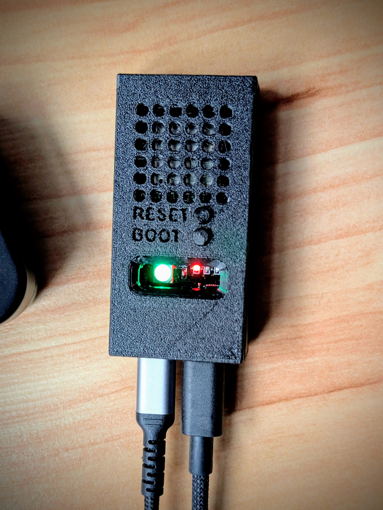
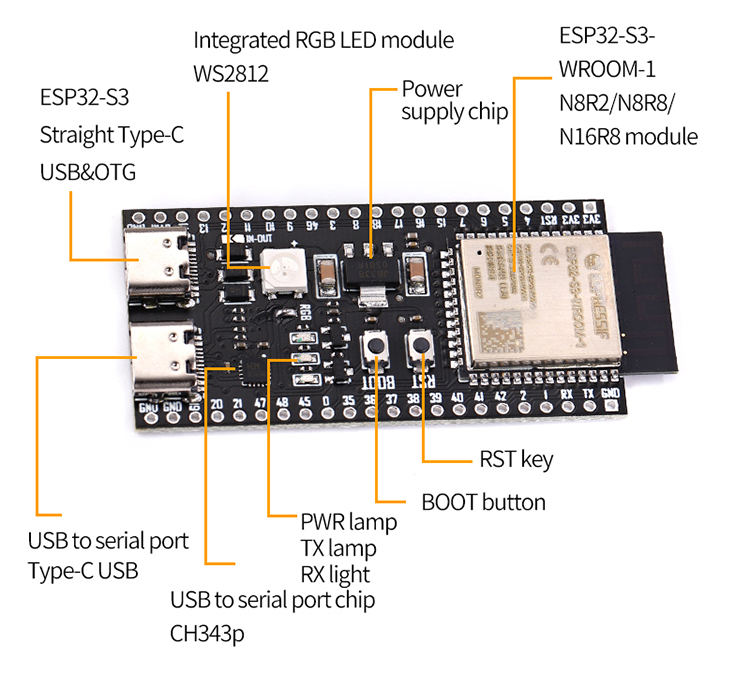
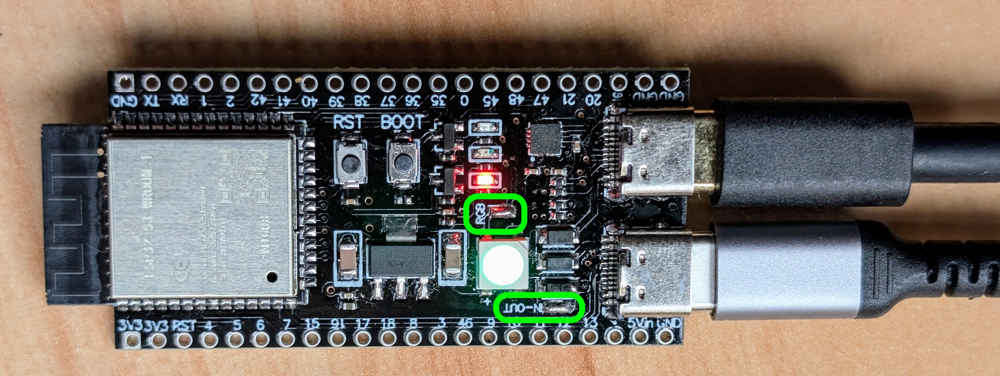
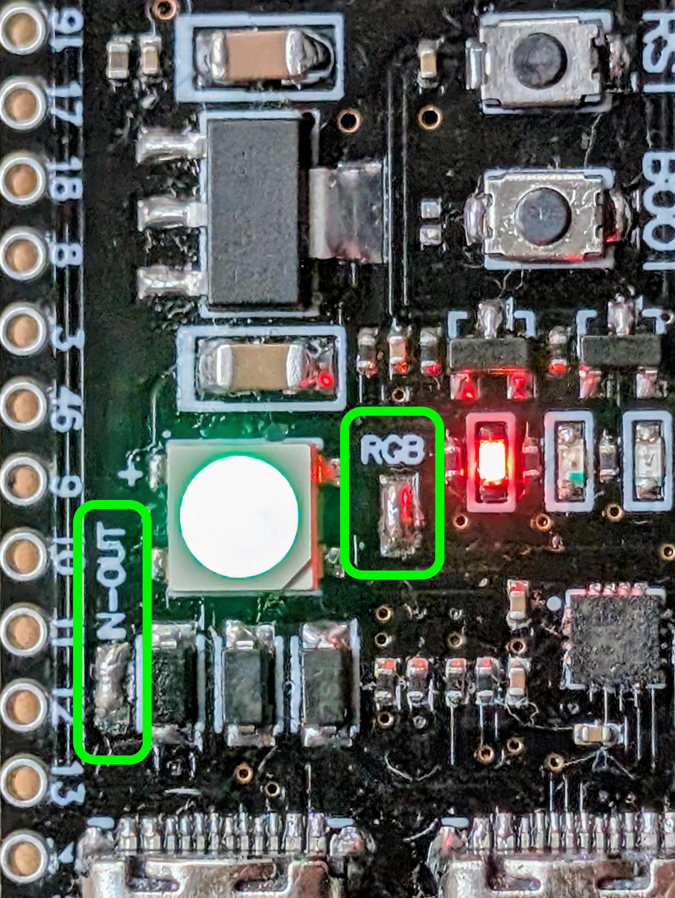
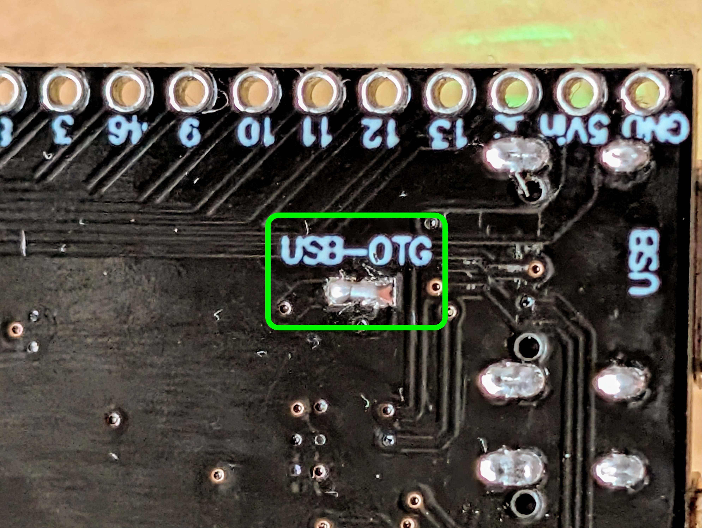
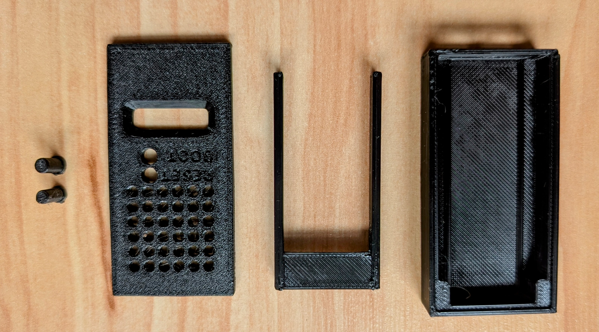

# RadPro WiFi Bridge Assembly (ESP32-S3)

The RadPro WiFi Bridge is an ESP32‑S3 DevKitC‑1‑N16R8V running the RadPro WiFi Bridge firmware. Acting as the gateway, it hosts a RadPro-enabled Geiger counter over the USB Type‑C OTG port, translates the USB/Serial data stream, and forwards readings via Wi‑Fi to MQTT and cloud publishers while the WS2812 RGB LED provides status feedback. The 16 MB flash and 8 MB PSRAM give the dual (Arduino + ESP-IDF) firmware plenty of headroom.

## Hardware Overview

- **Recommended board:** ESP32-S3-DevKitC-1-N16R8V (16 MB Flash, 8 MB PSRAM) for plenty of headroom for the dual-framework (Arduino + ESP-IDF) firmware.  
- **Ports:** Two USB‑C connectors — one OTG port for the detector and one power/debug port.  
- **Indicators:** On-board WS2812 RGB LED is driven by the firmware for status/error pulses.  

## Assembly Checklist

To enable USB host mode and the WS2812 LED you must close three solder jumpers on the DevKitC. Use a fine tip iron, plenty of flux, and verify continuity with a multimeter before powering the board.

### 1. Top-side bridges (RGB + USB data)

- **RGB LED bridge:** Routes GPIO48 to the on-board WS2812 so the LED can mirror bridge diagnostics.  
- **IN/OUT bridge:** Connects the USB D+/D− lines to the OTG controller so the ESP32-S3 can host the RadPro-enabled detector.

### 2. Bottom-side bridge (USB-OTG power)

- Close the “USB-OTG” jumper on the underside to power the device connected to the OTG port and allow VBUS sensing.

After soldering, connect the board via the debug USB‑C port and flash the firmware with the RadPro Web Installer or, if you prefer a local workflow, using PlatformIO (`pio run -t upload`). The OTG port should enumerate the connected Geiger counter automatically once the device is powered.

## 3D-Printed Case

- Source: [Teraflop on Printables](https://www.printables.com/@Teraflop)  
- Print in PETG or ABS for better heat tolerance. PLA also works if the unit remains indoors.  
- Recommended settings: 0.2 mm layer height, ≥20 % infill, and supports for the USB cut-outs.  
- Seat the DevKitC snugly in the case rails (no screws needed).

## Final Assembly & Connection

1. Plug the RadPro-enabled Geiger counter into the OTG USB‑C port.  
2. Power the board via the second USB‑C port or through the 5 V header.  
3. Watch the RGB LED: green pulsing indicates USB enumeration, cyan indicates Wi-Fi association, and red pulses flag USB or MQTT faults.  
4. Access the Wi-Fi portal (`radpro.local`) to configure MQTT, Radmon, OpenRadiation, and future publishers such as GammaSense/uRADMonitor once available.  

Keep the case vents unobstructed. The RadPro WiFi Bridge is now ready to forward dose-rate measurements to the configured cloud services. 
