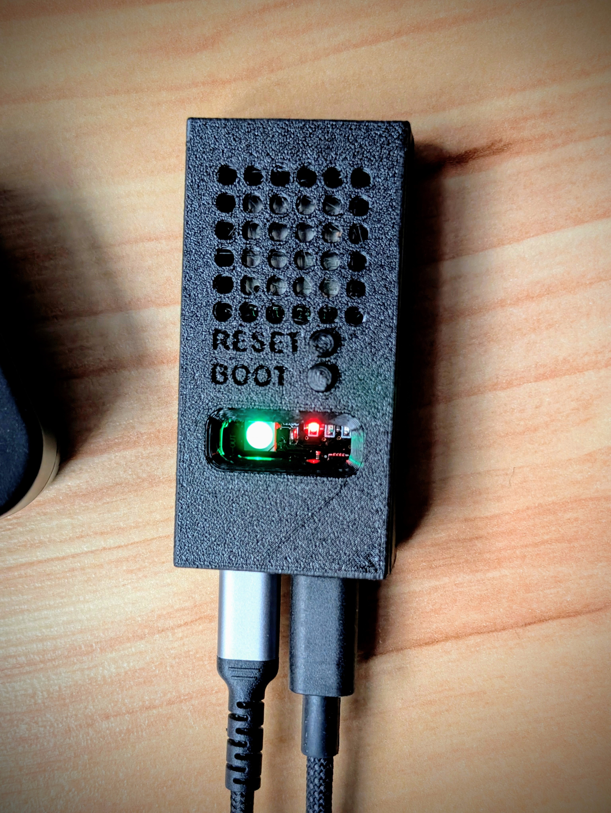
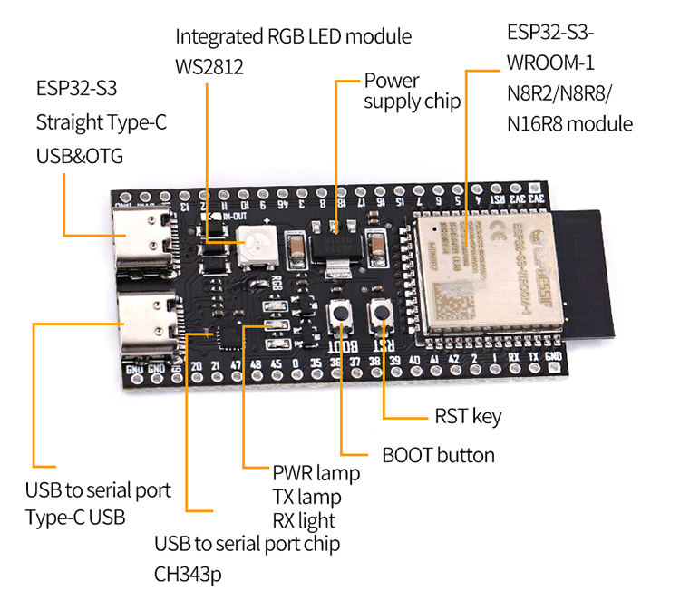
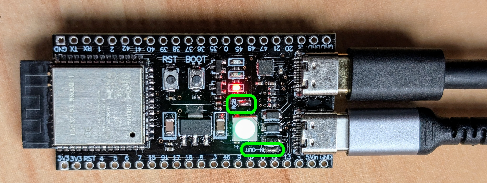
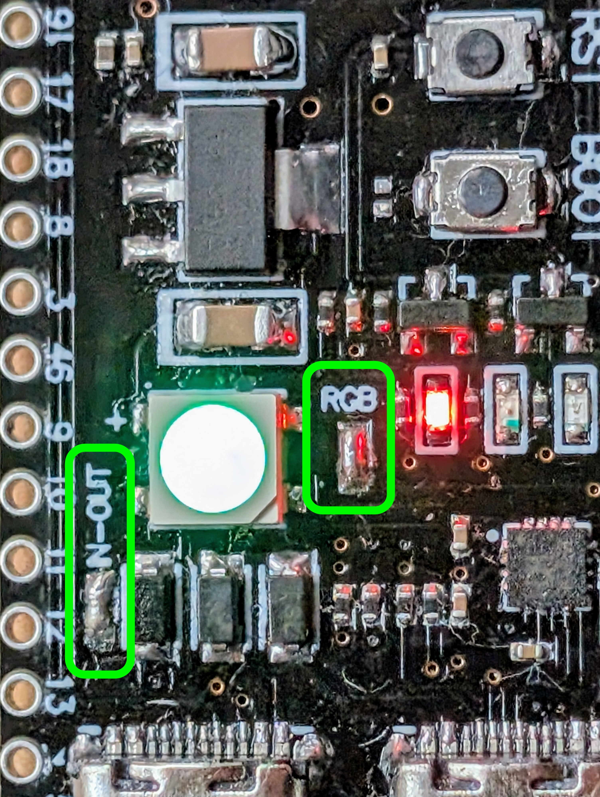
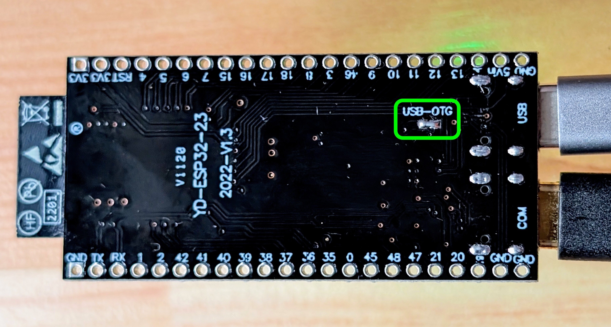
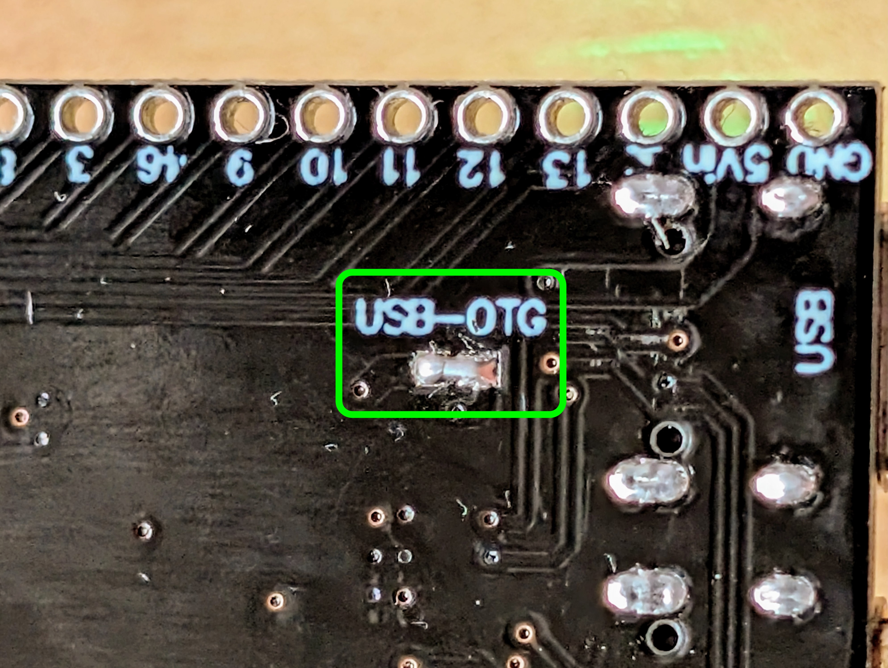
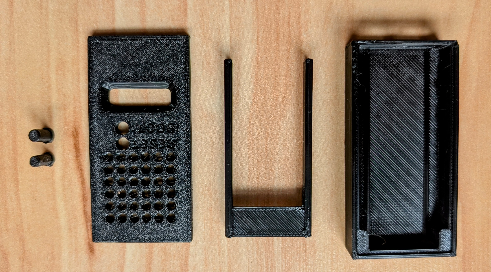

# RadPro WiFi Bridge Assembly (ESP32-S3)

The RadPro WiFi Bridge is built around an ESP32‑S3 DevKitC‑1 board running the RadPro WiFi Bridge firmware. The currently recommended variant is `ESP32-S3-DevKitC-1-N16R8`, while the older `N16R8V` remains compatible. Acting as the gateway, it hosts a RadPro-enabled Geiger counter over the USB Type‑C OTG port, translates the USB/Serial data stream, and forwards readings via Wi‑Fi to MQTT and cloud publishers while the WS2812 RGB LED provides status feedback. The default firmware layout expects `16 MB` flash; PSRAM is helpful headroom but not currently required by the source tree.

## Hardware Overview

- **Recommended board:** `ESP32-S3-DevKitC-1-N16R8` (16 MB Flash, 8 MB PSRAM). `N16R8V` is also compatible.
- **Minimum default-build requirement:** `16 MB` flash, USB OTG host capability, and routing/jumpers equivalent to the DevKitC board shown below.
- **Ports:** Two USB‑C connectors are strongly recommended — one OTG port for the detector and one power/debug port.
- **Indicators:** The on-board WS2812 on `GPIO48` is used for status/error pulses, but the current firmware does not require PSRAM.

## Assembly Checklist

To enable USB host mode and the WS2812 LED you must close three solder jumpers on the DevKitC. Use a fine tip iron, plenty of flux, and verify continuity with a multimeter before powering the board. If you are evaluating a different ESP32-S3 board, first compare it against [board-requirements.md](board-requirements.md). If you can’t solder the bridges yourself, check the nearest makerspace or FabLab—community workshops often have the right tools and volunteers who can help. Useful directories:

- [FabLabs.io](https://www.fablabs.io/labs) – official Fab Lab network map (list + JSON export).
- [Hackerspaces.org](https://wiki.hackerspaces.org/List_of_Hacker_Spaces) – global hacker/maker space directory.
- [MapComplete “Hackerspaces & Makerspaces”](https://mapcomplete.osm.be/hackerspaces.html) – OpenStreetMap-based map maintained by the community.
- [Make Magazin (Germany)](https://www.make.de/makerspaces) – German-language makerspace overview (submit your space via make.de).
- [Makers United – Sachsen](https://makers-united.de/makerspaces/) – regional map covering Saxony (handy for Vogtland & surroundings).
- [MapAll.Space](https://mapall.space/) – aggregates SpaceAPI, FabLabs, hackerspaces.org into a single heatmap.
- [CyberLab Makerspace Map](https://www.cyberlab.de/makerspace-map) – curated list of German makerspaces accessible to startups.

### 1. Top-side bridges (RGB + USB data)

- **RGB LED bridge:** Routes GPIO48 to the on-board WS2812 so the LED can mirror bridge diagnostics.  
- **IN/OUT bridge:** Connects the USB D+/D− lines to the OTG controller so the ESP32-S3 can host the RadPro-enabled detector.

### 2. Bottom-side bridge (USB-OTG power)

- Close the “USB-OTG” jumper on the underside to power the device connected to the OTG port and allow VBUS sensing.

After soldering, connect the board via the debug USB‑C port and flash the firmware with the RadPro Web Installer or, if you prefer a local workflow, using PlatformIO (`pio run -t upload`). The OTG port should enumerate the connected Geiger counter automatically once the device is powered.

## 3D-Printed Case

- Source: [Teraflop on Printables](https://www.printables.com/@Teraflop)  
- Print in PETG or ABS for better heat tolerance. PLA also works if the unit remains indoors.  
- Recommended settings: 0.2 mm layer height, ≥20 % infill, and supports for the USB cut-outs.  
- Seat the DevKitC snugly in the case rails (no screws needed).

## Final Assembly & Connection

1. Plug the RadPro-enabled Geiger counter into the OTG USB‑C port.  
2. Power the board via the second USB‑C port or through the 5 V header.  
3. Watch the RGB LED: steady green indicates a ready detector, cyan indicates Wi-Fi is joined but the detector is not ready yet, and amber blinking means a communication or telemetry alarm needs attention.
4. Access the Wi-Fi portal (`radpro.local`) to configure MQTT, Radmon, OpenRadiation, and future publishers such as GammaSense/uRADMonitor once available.  

Keep the case vents unobstructed. The RadPro WiFi Bridge is now ready to forward dose-rate measurements to the configured cloud services. 
