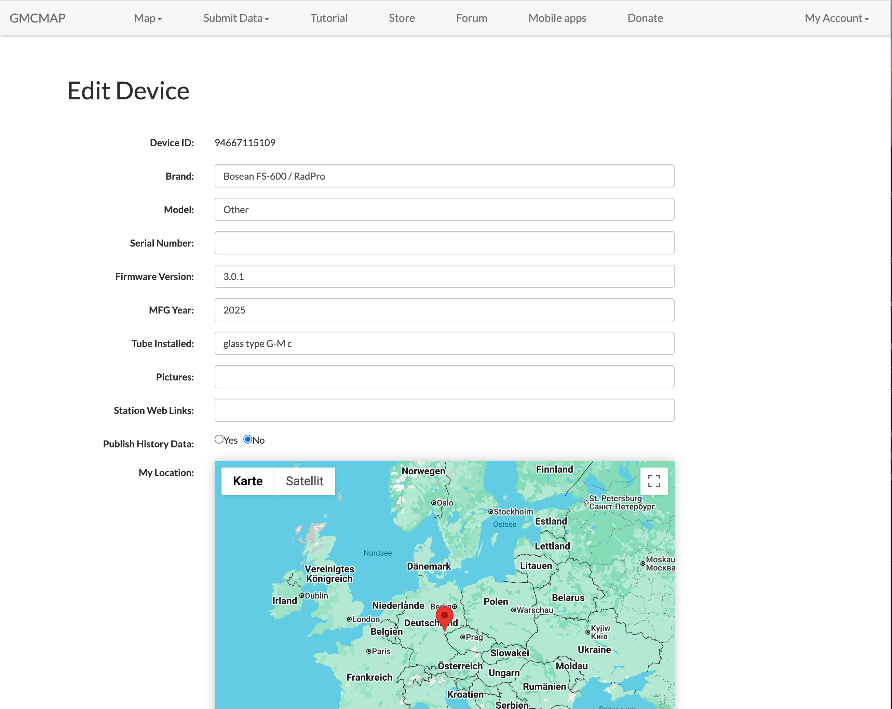
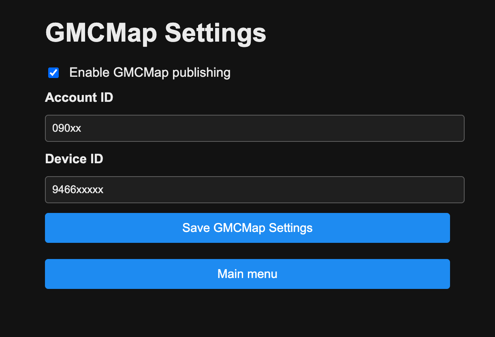

# GMCMap Publishing

This guide explains how to configure the RadPro WiFi Bridge to submit readings to [GMCMap](https://www.gmcmap.com/).

## 1. Get Your GMCMap Credentials

1. Log in to GMCMap and open **My Account** → **My Geiger Counter**.
2. For the device you want to feed with the bridge, note:
   - **Account ID** (a numeric identifier).
   - **Device ID** (also numeric, unique per counter).
   - Optional **Password** (only if you set one—leave blank otherwise).

These values appear on the device details page and are needed in the bridge portal.

## 2. Configure the RadPro WiFi Bridge

1. Open the Wi-Fi portal and go to **Configure GMCMap**.
2. Tick **Enable GMCMap publishing**.
3. Enter:
   - **Account ID** – from the GMCMap dashboard.
   - **Device ID** – the device you want to report measurements for.
4. Save the form; credentials are stored in NVS immediately.

## 3. Publishing Behaviour

- The bridge waits until it has both tube rate (CPM) and dose rate (µSv/h) readings.
- It sends a single HTTP GET request to `https://www.gmcmap.com/log2.asp` with:
  - `AID=<Account ID>`
  - `GID=<Device ID>`
  - `CPM=<tube rate>`
  - `uSv=<dose rate>`
- Requests are throttled to roughly once per minute to respect GMCMap’s API guidelines.

## 4. Verifying Data

- On the bridge serial console, look for `GMCMap: GET ...` entries confirming submissions.
- In GMCMap, open **Recent Data** or the device page to see CPM/µSv/h entries from the bridge.

## Troubleshooting

| Symptom | Fix |
| --- | --- |
| HTTP 403/`GID invalid` | Device ID doesn’t exist or doesn’t belong to the provided Account ID. Double-check both values. |
| HTTP 400 | Missing parameters—ensure CPM and µSv/h readings are available and IDs are filled in. |
| No data in dashboard | Give the bridge a minute between submissions; verify the device password (if any) matches GMCMap’s record. |

Disable the feature if you are not using GMCMap; no HTTP traffic is generated unless the toggle is on and valid IDs are configured. \ No newline at end of file
