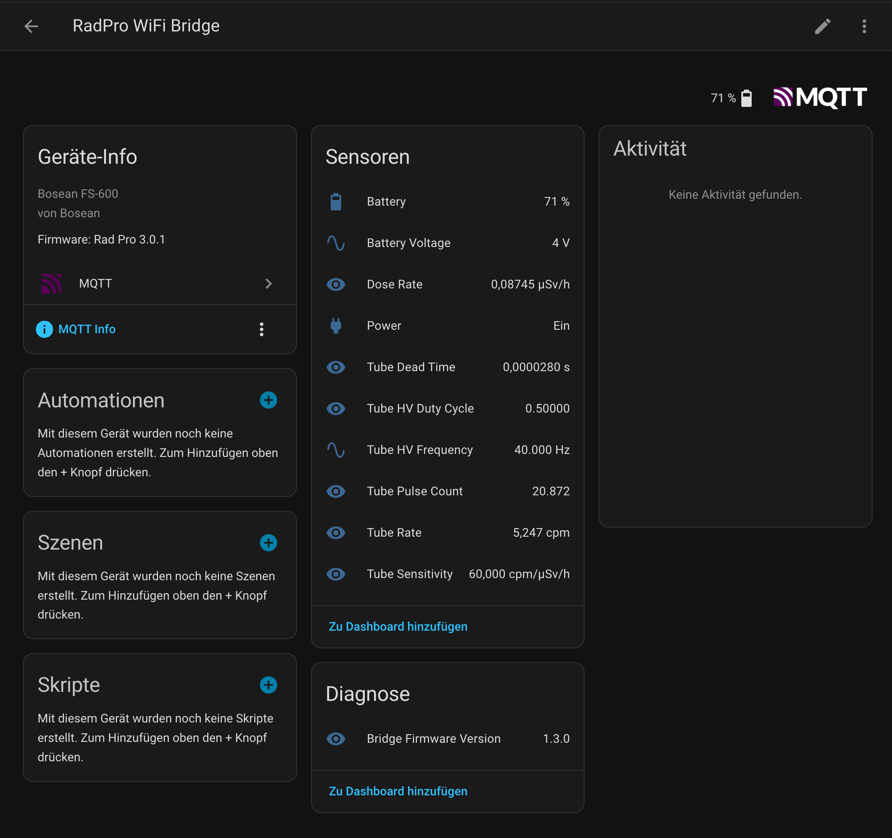
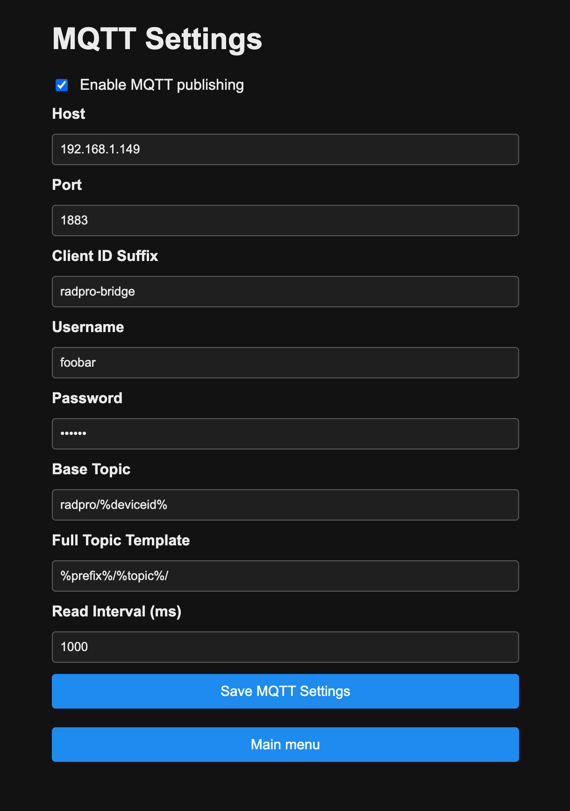

# MQTT & Home Assistant Integration

This guide walks through configuring the RadPro WiFi Bridge to publish RadPro telemetry over MQTT and explains how Home Assistant automatically discovers the exposed entities.

## 1. Prepare Your MQTT Broker

1. Run an MQTT broker such as Mosquitto (Home Assistant add-on or stand-alone).
2. Create a dedicated MQTT user/password, or enable anonymous access:
   - **Home Assistant add-on:** set `anonymous: true` under the add-on options, *or* add a user in Home Assistant and grant MQTT access.
3. Note the broker host/IP and port (default 1883).

> **Tip:** A `MQTT connect failed: 5` log on the bridge means the broker rejected the credentials.

## 2. Configure MQTT in the Portal

1. Power the bridge and connect via Wi-Fi/Captive portal.
2. Open **Configure MQTT**:
   - Toggle **Enable MQTT publishing**.
   - Fill in host, port, client ID suffix, username/password.
   - Adjust the base topic (`mqttTopic`) and full topic template (`mqttFullTopic`) if you want to customise the namespace. Defaults yield `stat/radpro/<deviceid>/<leaf>`.
   - Set the RadPro polling interval (`readIntervalMs`, minimum 500 ms).
3. Save to write the settings to NVS; the bridge will reconnect with the new details.

## 3. Published Topics

Once connected, every RadPro response is forwarded to MQTT. The bridge publishes (retained) leaves such as:

- `bridgeVersion`, `deviceId`, `devicePower`
- `deviceBatteryVoltage`, `deviceBatteryPercent`
- `tubePulseCount`, `tubeRate`, `tubeDoseRate`, `tubeDeadTime`, `tubeDeadTimeCompensation`
- `tubeHvFrequency`, `tubeHvDutyCycle`
- Diagnostic entries like `randomData` or `dataLog` (not retained)

Topic templating variables:

- `%deviceid%` → lower-case slug of the RadPro device ID.
- `%DeviceId%` → exact device ID.
- `%prefix%` and `%topic%` → inserted into the full topic template to build the final MQTT topic string.

## 4. Home Assistant Discovery

As soon as the bridge learns the RadPro device ID it emits MQTT Discovery payloads under `homeassistant/<component>/<unique_id>/config`. Home Assistant automatically creates entities for:

- Tube rate (cpm) sensor
- Tube dose-rate sensor
- Pulse count
- Battery voltage & percentage
- Device power state
- Bridge firmware/diagnostics

Entities update in place whenever you rename the device in the portal or change topics. To ensure Home Assistant keeps the discovery data:

- Keep MQTT retain enabled (default behaviour on the bridge).
- If you purge retained messages manually, restart the bridge afterward to republish discovery payloads.

### Fixing Missing Entities

If Home Assistant doesn’t show the entities:

1. Confirm the bridge is publishing to the broker (`mosquitto_sub -v -t 'homeassistant/#'`).
2. Ensure the Home Assistant broker has `retain` enabled and that discovery is turned on (`mqtt:` in `configuration.yaml`).
3. Clear stale discovery topics:
   - Delete `homeassistant/radpro_*` retained topics (e.g. via MQTT Explorer).
   - Restart the bridge so it re-sends discovery payloads.

## 5. Using the Data

Once entities appear, you can:

- Display tube rate / dose rate in Lovelace dashboards.
- Trigger automations (e.g., notification if dose rate exceeds a threshold).
- Record long-term statistics using Home Assistant’s Recorder/History.

## Troubleshooting Checklist

| Symptom | Fix |
| --- | --- |
| `MQTT connect failed: -1` | Broker unreachable (check host, port, Wi-Fi) |
| `MQTT connect failed: 5` | Bad username/password or anonymous disabled |
| Entities missing after rename | Clear retained `homeassistant/` topics and restart bridge |
| State updates delayed | Lower `readIntervalMs` (>= 500 ms) and ensure broker isn’t rate-limited |

For more detail on the firmware internals, see the “MQTT Publishing” section in the root README. \ No newline at end of file
