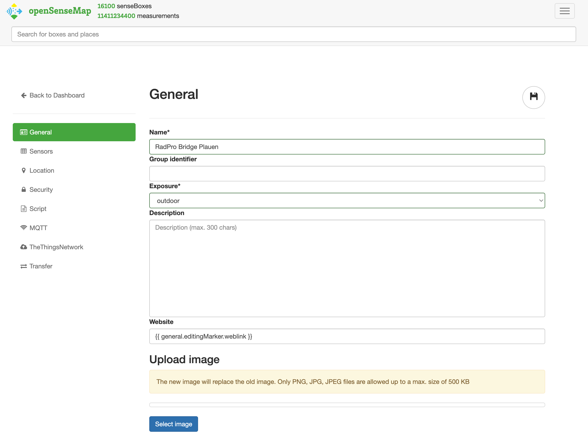
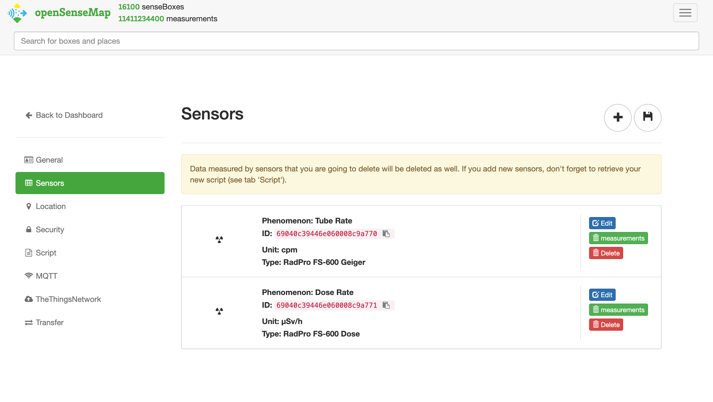
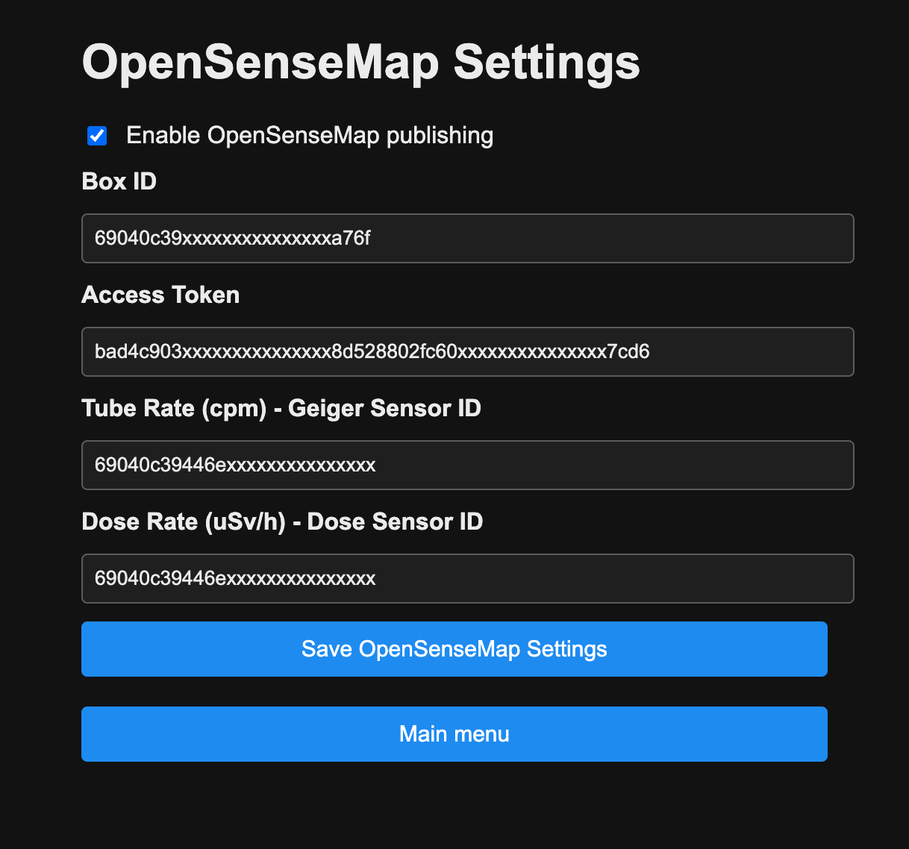

# OpenSenseMap Integration

This walkthrough covers creating a senseBox, collecting the required IDs, and configuring the RadPro WiFi Bridge so tube rate and dose rate are forwarded to [openSenseMap](https://opensensemap.org/).

## 1. Create or Prepare Your senseBox

1. Log in to openSenseMap and choose **Create a senseBox** (or edit an existing one dedicated to RadPro data).
2. Fill in:
   - **Station name** and **description** (e.g., “RadPro WiFi Bridge”).
   - **Exposure** (indoor/outdoor/mobile) to match the installation.
   - Location (drag the map marker or enter coordinates).
3. Under **Hardware**, select **Manual configuration**.
4. Add two sensors:
   - **Tube Rate (cpm)** – Unit `cpm`, type “RadPro FS-600 Geiger” (or any Geiger count rate type).
   - **Dose Rate (µSv/h)** – Unit `µSv/h`, type “RadPro FS-600 Dose” (or any dose-rate type).
5. Save the box; the confirmation screen lists the **senseBox ID**, **Access Token**, and each sensor’s `_id`.

## 2. Grab the Required IDs

You need four values for the RadPro bridge:

| Field | Where to find it |
| --- | --- |
| senseBox ID | Summary page after saving the box, or `My senseBoxes` → select box → **General** |
| Access Token (API key) | Same summary page (`Access Token`), also under **Edit box** → **General** |
| Tube rate sensor `_id` | `My senseBoxes` → pick box → **Equipment** tab (copy the ID next to the tube rate sensor) |
| Dose rate sensor `_id` | Same page, ID next to the dose rate sensor |

> Alternative: `GET https://api.opensensemap.org/boxes/<senseBoxId>` returns JSON; copy the `_id` values from the `sensors` array.

## 3. Configure the RadPro WiFi Bridge

1. Open the bridge portal and select **Configure OpenSenseMap**.
2. Tick **Enable OpenSenseMap publishing**.
3. Enter:
   - **Box ID** → senseBox ID.
   - **Access Token** → API key.
   - **Tube Rate Sensor ID** → `_id` of the CPM sensor.
   - **Dose Rate Sensor ID** → `_id` of the µSv/h sensor.
4. Save the form; settings are stored in NVS.

### How the Bridge Publishes

- Tube rate and dose rate are queued until both are available, then sent together via HTTPS (about every 4 s) to stay within openSenseMap’s API limits.
- Wi-Fi/API failures trigger retries with a short back-off; nothing is sent while the feature is disabled or IDs are missing.

## 4. Verify Data Flow

- In openSenseMap, open your senseBox and check the **Measurements** view for incoming CPM/µSv/h points.
- Use the bridge serial console to confirm transmissions (look for `OpenSenseMap: POST tube=...` lines) or enable the raw USB logs if troubleshooting.

## Troubleshooting

| Issue | Fix |
| --- | --- |
| `OpenSenseMap: connect failed` | Wi-Fi or DNS issue; verify network connectivity. |
| HTTP 4xx/5xx errors | Re-check Box ID, API key, sensor IDs; ensure the Access Token hasn’t been revoked. |
| No data in graph | Make sure both sensor IDs are set— tube and dose are uploaded together. |

Need to change sensor naming or add extra metadata? You can edit the senseBox at any time; just keep the sensor IDs in sync with the bridge configuration. \ No newline at end of file
