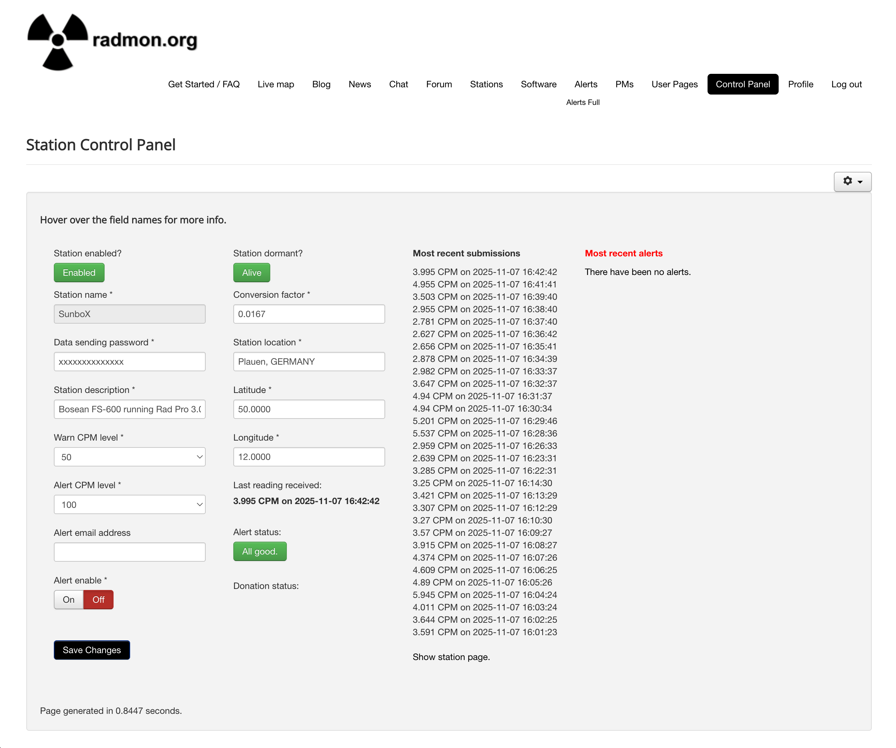
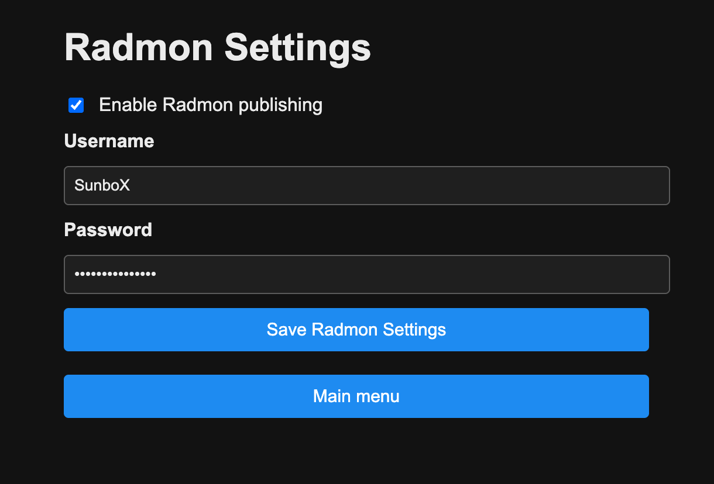

# Radmon.org Publishing

Use this guide to connect the RadPro WiFi Bridge to [radmon.org](https://radmon.org), including the station setup and bridge configuration.

## 1. Prepare Your Radmon Station

1. Create an account on radmon.org and log into the **Station Control Panel**.
2. Under **Station Settings**:
   - Choose a **Station Name** and location.
   - Set the **Data sending password** – this is the credential you’ll enter in the bridge portal.
   - Specify the **Conversion factor** (µSv/h per CPM). For an unmodified RadPro Geiger counter the default is roughly `0.0167`. Adjust if you have a calibration.
3. Note your **Username** and the chosen **Data sending password**.

## 2. Configure the RadPro WiFi Bridge

1. Open the Wi-Fi portal and select **Configure Radmon**.
2. Tick **Enable Radmon publishing**.
3. Enter:
   - **Radmon Username** – your station username (case sensitive).
   - **Radmon Password** – the *data sending* password from the Radmon control panel.
4. Save. Credentials are written to NVS and take effect immediately.

### Publishing Behaviour

- The bridge sends `GET https://radmon.org/radmon.php?function=submit&user=<user>&password=<pass>&value=<CPM>&unit=CPM`.
- When dose rate is available it adds `value2=<µSv/h>&unit2=uSv/h`.
- Requests are spaced at least 60 seconds apart to stay within radmon.org rate limits.
- Successful posts clear the retry timer; failures trigger retries with a one-minute back-off.

## 3. Verify Data

- Watch the bridge serial console for entries like `Radmon: GET /radmon.php?...`.
- On radmon.org, open **Latest Data** or your station page to confirm CPM/µSv/h values are arriving.

## Troubleshooting

| Symptom | Fix |
| --- | --- |
| HTTP 401/403 response | Username/password mismatch – re-enter the *data sending* password (not your website login password). |
| HTTP 5xx response | Temporary radmon outage; the bridge will retry automatically after 60 s. |
| No data on station page | Ensure you let the tube run long enough for both CPM & dose readings; check the conversion factor matches your hardware. |

Once configured, the bridge handles all scheduling—no cron jobs or scripts required. Leave the feature disabled if you are not using radmon.org; the firmware will skip all HTTP requests until you enable it. \ No newline at end of file
